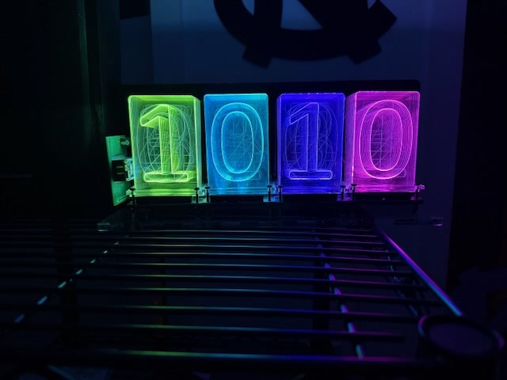

# lixie-clock-fw

Firmware for Lixie-style edge-lit LED clocks running on a **Particle Photon 1 (Gen 2)**.

Each clock configures itself from a built-in web page, keeps time over NTP with real
timezone and DST handling, runs lighting effects on a sunrise/sunset-aware schedule,
and shows up in Home Assistant automatically over MQTT.

Replaces the earlier [djb-rh/lixie-clock](https://github.com/djb-rh/lixie-clock)
firmware, which had compile-time colors and four hardcoded modes.


*Rainbow Flow. The hue is a function of each panel's position across the display, so the
colour sweeps rather than the whole clock changing together — that is what distinguishes it
from Rainbow Cycle. Full clip: [rainbow-flow.mp4](docs/images/rainbow-flow.mp4) (plays in
GitHub's file viewer).*

## Status

**Feature-complete.** All six phases done and verified on hardware. Both clocks keep correct
local time with full DST handling, are configurable from a browser at `http://<clock-ip>/`,
run eight lighting effects at 30 fps, switch settings on a sunrise/sunset-aware schedule,
and appear in Home Assistant automatically as a light plus diagnostics. See `docs/` for
per-phase results, `docs/deploying.md` to flash a clock, and `docs/hardware.md` for wiring.

### Effects

`Solid` · `Rainbow Flow` · `Rainbow Cycle` · `Breathe` · `Pulse` · `Comet` · `Twinkle` ·
`Warm Glow`



No effect is allowed to black out the display — a clock you cannot read is not a clock — so
the brightness-modulating effects floor rather than dipping to zero. See
`docs/phase3-results.md`.

### Settings worth knowing

- **Observe daylight saving time** can be turned off to stay on standard time year-round.
  The full timezone rule stays stored either way, so turning it back on needs no
  re-selection.
- **Backup → Copy settings** exports everything except passwords as JSON, so a second clock
  can be set up by pasting. Passwords are never exported — the clock will not read them
  back — so they are typed once per clock.
- Colours are labelled in words as well as shown as a swatch.

### Home Assistant

Set the broker under **Home Assistant** on the config page. Use the broker host's **IP or
a DNS-resolvable name** — `core-mosquitto` is internal to Home Assistant's container
network and `*.local` is mDNS, neither of which a Photon can resolve.

Control from Home Assistant is **sticky**: it holds until you press *Return to schedule*
(in HA, or in the banner on the config page). A schedule transition will not take control
back on its own.

## Tests

Calendar, timezone, JSON and config-layout logic is Particle-free and tested on the host:

```bash
cd tests && make
```

`make asan` reruns everything under AddressSanitizer and UBSan — worth it for the JSON
scanner, which parses untrusted input off the network.

`make vectors` regenerates `tz_vectors.txt`, which cross-checks the device's POSIX parser
against the browser's Intl-derived rules across 38 zones (needs `node`).

`tools/gen_solar_vectors.py` regenerates `solar_vectors.txt`, which checks the NOAA solar
implementation against `astral` across 9 locations and 8 dates (needs `pip install astral`).
Both vector files are committed, so `make` alone needs neither tool.

## Hardware

| Clock | Device ID | Notes |
|---|---|---|
| `Clock2` | `270049000251353530373132` | Particle Product 42326 · `Lixie Clock 373132` |
| `shop-clock` | `290028001047363333343437` | Developer device · `Lixie Clock 343437` |

WS2812B, 20 LEDs per digit, data on `D0`. Digit count is configurable (2–6).

## Building

Requires the [Particle CLI](https://docs.particle.io/getting-started/developer-tools/cli/).
Device OS is pinned to **2.3.1**, the terminal 2.x LTS release — Gen 2 devices cannot
run 3.x or later.

```bash
python3 tools/build_web_assets.py        # regenerate src/web_assets.h
particle compile photon --target 2.3.1
```

The config page lives in flash as a gzipped blob, because the Photon 1 has no
filesystem and only 128 KB of application flash. **Run the asset script after any
change to `web/index.html`** — `src/web_assets.h` is generated and not committed.

To flash:

```bash
particle flash shop-clock
```

## Design notes

- **Cloud-optional.** The Particle Cloud is kept for OTA flashing only. Everything
  the clock does — timekeeping, schedule, web UI, Home Assistant — works with the
  cloud unreachable. If Particle ever retires Gen 2 cloud service, the clocks keep
  running; only OTA is lost.
- **Timezones carry no on-device database.** The browser derives a POSIX TZ rule
  (e.g. `EST5EDT,M3.2.0,M11.1.0/2`) and the device stores those 48 bytes. Re-saving
  the page picks up any rule changes your browser has learned.
- **MQTT is plaintext** on the LAN. TLS is not practical in the Photon 1's RAM budget.
- **No `String` in hot paths.** Fixed `char` buffers throughout; the Photon's `String`
  fragments the heap and these run for months at a time.
- **Optional web password** gates writes only, and is not real security over plain
  HTTP — it prevents accidents, not attackers.

## Licensing

MIT. The solar math in `src/solar.cpp` is written from the published NOAA algorithm
rather than vendored from the LGPLv3 `Sunrise` library the old firmware used, so the
whole tree stays permissively licensed with no copyleft entanglement.
