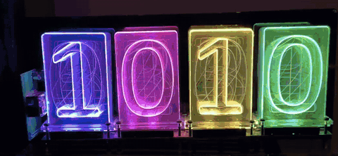

# Phase 3 — Effects

Eight effects, selectable from the config page, animating on hardware.

```
Flash  54,256 / 131,072   Static RAM  11,412   Free heap  ~31,300
```



*Hue varies with panel position, which is the property
`tests/effects_test.cpp` asserts numerically as `flowSpread > 60` — this is the same claim
in a form anyone can check at a glance.*

## Design

An effect is a **pure function** of `(panel position, time, base colour)` — no state, no
allocation, no Particle dependency. That is what makes the whole set sweepable on the
host instead of verifiable only by standing in front of a clock.

Position is the panel's place across the display, normalised to 0..1. That is the
coordinate that reads visually: a Lixie stacks its ten numeral panels front-to-back
within one digit, so depth is not a useful axis, but left-to-right across the digits is.

Global brightness is deliberately **not** applied inside effects. `Display::show()`
scales afterwards, so the Home Assistant dimmer will behave identically in every mode.

| Effect | Behaviour |
|---|---|
| Solid | The configured colour, unmodulated |
| Rainbow Flow | Hue sweeps across the display and drifts with time |
| Rainbow Cycle | Whole display cycles hue together |
| Breathe | ~6 s swell, deep and slow |
| Pulse | ~1.3 s, squared so it snaps rather than swells |
| Comet | A bright head sweeps left to right, trailing off behind |
| Twinkle | Each panel eases toward a new random level every ~700 ms |
| Warm Glow | Slow drift through amber and orange; ignores the base colour |

All integer math. The Photon 1 is a Cortex-M3 with no FPU, and while a few floats per
frame would be affordable, there was no reason to spend them.

## The invariant that matters

**No effect may black out the display.** A clock you cannot read is not a clock, so
brightness-modulating effects floor at `FX_MIN_LEVEL` (64/255 of their own colour) rather
than dipping to zero. `tests/effects_test.cpp` sweeps every effect across 10 minutes of
animation at 2, 4 and 6 panels and asserts both that no single panel ever goes black and
that the brightest panel on the display never drops below a legible level.

That second check matters separately: Comet *does* drive individual panels to the floor —
that is the effect — but the display as a whole must stay readable.

Two related properties are pinned: effects are deterministic (Twinkle hashes its inputs
rather than calling `rand()`, so it can be tested at all), and a black base colour stays
black — the floor is relative, not additive, so it cannot resurrect an off display.

One test reading is easy to misread: Rainbow Cycle's dimmest sample is luma 28. That is
*full-intensity blue* — Rec.601 weights blue at 11% — not a dim display.

## 30 fps, not 50

`NeoPixel::show()` disables interrupts for the entire transmission: about 2.4 ms for
80 LEDs at 800 kHz. At 50 fps that is 12% of wall-clock time with interrupts off, taken
away from the Wi-Fi stack, for effects that are all slow gradients anyway. 33 ms halves
it and looks identical.

A static display costs nothing at all: solid mode still re-renders only when something
visible changes. Measured **0 frames in 5 seconds** while showing a steady colour.

## Single source of truth for effect names

`/api/config` now serves the effect list straight from `EFFECT_NAMES`, and the page builds
its dropdowns from that rather than carrying its own copy. The same array will feed Home
Assistant's `effect_list` in Phase 5, so a rename cannot leave three places disagreeing
about which id is which effect.

Effect ids are clamped to `FX_COUNT - 1` on input rather than a magic 15.

## Verified on hardware

Nobody can see the clock from a terminal, so `/api/state` reports `frames`, `fx_name` and
`lit` (the colour the leftmost lit panel last received) — enough to tell a running effect
from a stalled one remotely.

- All 8 effects render: Solid is exactly `[255,136,0]`, the rainbows are fully saturated,
  the modulators scale amber, Warm Glow lands warm at `[205,125,13]`
- Rainbow Flow sampled once a second walks yellow → green → cyan → blue → magenta
- **29 fps** sustained; solid mode 0 fps
- **2.5-minute soak** under continuous polling: 30/30 requests answered in 26–41 ms, free
  heap flat at 31,272 bytes across 4,200+ frames, no reboots, no Wi-Fi recoveries, cloud
  connected throughout

The soak was the point: it confirms that interrupt-disabling LED writes at 30 fps do not
destabilise the radio, which was the one real risk in this phase.

## Confirmed by eye

Every effect was initially verified by its maths and by the colours the firmware reported,
not by looking at anything — which left open whether the speeds were *tasteful* as well as
correct. They are: the clock's owner reported the effects looked good, and the clip above
is Rainbow Flow running on real hardware.
